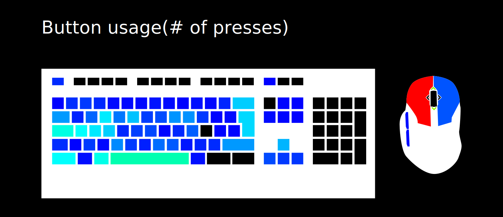
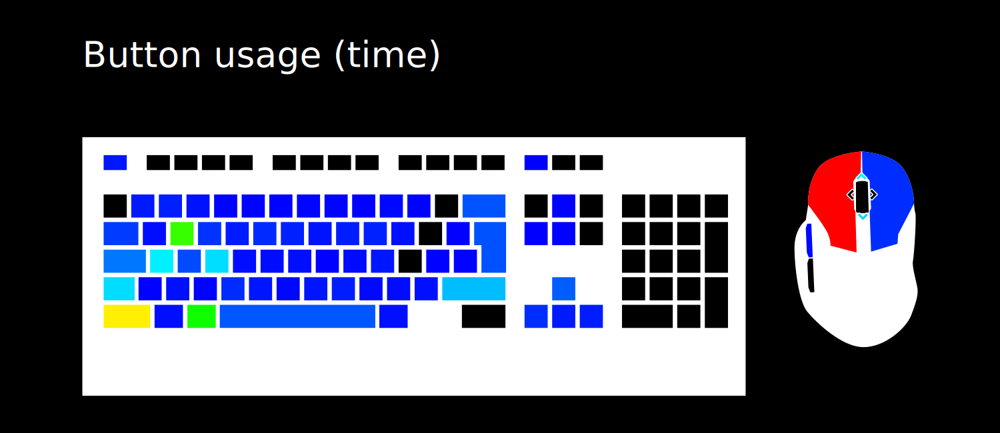

# KeyHeatMap

A little tool that counts how often and how long you press which key on linux.

 

## Compiling and running the daemon

This tool probably requires linux, as it uses evdev and udev.

```
cargo build --release
sudo cp target/release/keyheatmap-{client,daemon} /usr/local/bin
sudo cp resources/keyheatmap-daemon.service /etc/systemd/system
systemctl enable --now keyheatmap-daemon
```
Use the `--now` -- otherwise the first thing that is logged is which keys are needed for your password.

## Creating the heatmap

```
keyheatmap-client
```

This will create `keyheatmap_count.svg` and `keyheatmap_time.svg`. No runtime configuration is possible.

## Misc

Repeats aren't counted, and the mouse scroll bindings use other keys, so beware if `KEY_SCROLLUP` does weird stuff.

You can edit `resources/template.svg` with inkscape if the layout or so is wrone. Then convert the inkscape names to ids with the [Label To Id Plugin](https://gitlab.com/inklinea/label-to-id) and export as a plain SVG to `resources/template_plain.svg`.
Alternatively you can also directly edit the SVG file.

## Why?


Charts and generally data is cool, and I was bored so I made cool heatmaps.
